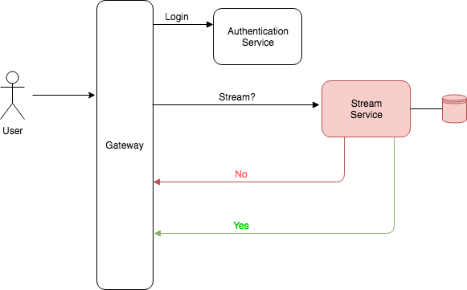

# Stream Service

A video streaming service that checks how many video streams a user is watching which also prevents a user from watching more than 3 streams at a time.

### Prerequisites

- [nodejs](https://nodejs.org/en/)
- [yarn](https://yarnpkg.com/en/)

## Deployment

`pm2 deploy ecosystem.config.js staging`

## Endpoints

`GET` - `/watch`

- returns 400 bad request - if session ID is not present
- returns 401 unauthorized - if the concurrent stream count has been exceeded

`GET` - `/health`

returns 200 - {"status":"UP"}

## Testing

## Server

- `curl -v failblazing.com/watch` -- 400
- `curl -v --header "Session-Id: lkjlkjely" 'failblazing.com/watch'` -- 200
- `curl -v --header "Session-Id: lkjlkjely" 'failblazing.com/watch'` -- 200
- `curl -v --header "Session-Id: lkjlkjely" 'failblazing.com/watch'` -- 200
- `curl -v --header "Session-Id: lkjlkjely" 'failblazing.com/watch'` -- 401

### Locally

- `yarn start`

- `curl -v localhost:3001/watch` -- 400
- `curl -v --header "Session-Id: lkjlkjely" 'localhost:3001/watch'` -- 200
- `curl -v --header "Session-Id: lkjlkjely" 'localhost:3001/watch'` -- 200
- `curl -v --header "Session-Id: lkjlkjely" 'localhost:3001/watch'` -- 200
- `curl -v --header "Session-Id: lkjlkjely" 'localhost:3001/watch'` -- 401

## Architecture

To implement this I first came up with an imagined system design in which this service would live. In this system auth concerns are handled by a gatway which routes auth requests to the authentication service, maybe assigns a user a session, with all subsequest requests to other services in the system only allowed through if they have a valid session. Maybe the session is also checked with the auth service for valididity? The point being is that these concerns don't have to be implemented in this service.

The flow might go like this..
1. Login - auth service authenticates the user and assigns a session id.
2. Request to view content - session id is present on in a cookie, which gateway validates.
3. Request is forwarded to the stream service as a HTTP header. Cookies are a front end concern so this should not be forwarded as such.
4. User is streamed the content or a stream ID is returned to so that a subsequent request can be made to a server that serves the content.

## Scaling

* Horizontally scale service as it is stateless. If you use plaform such as Kubernetes, scale it up..
* Shard database on session ID so that load to database is partitioned.